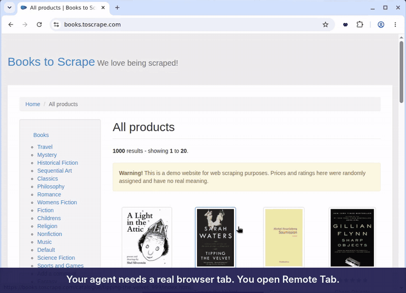
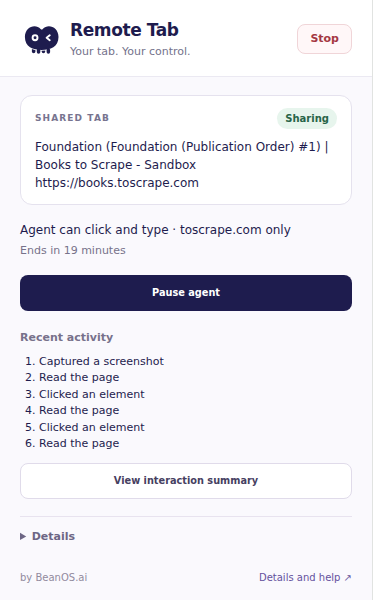
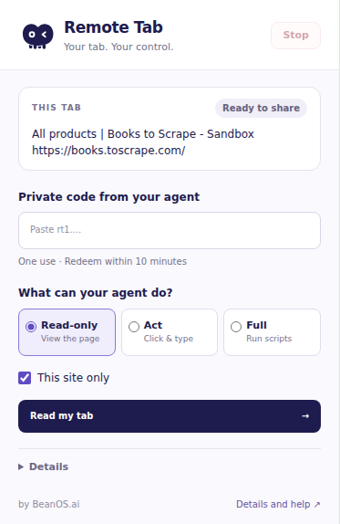
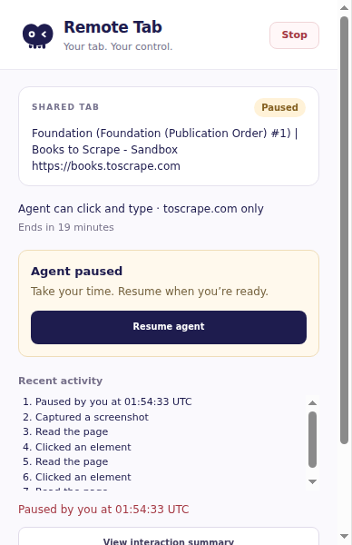
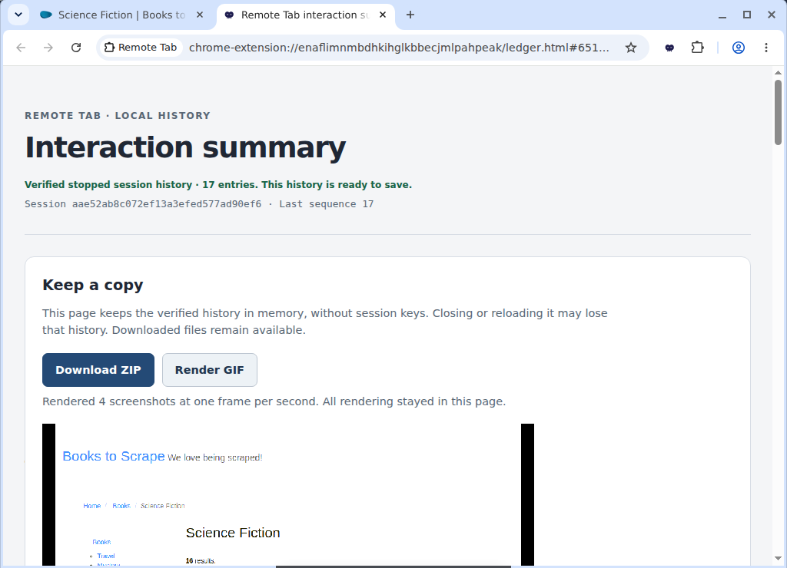
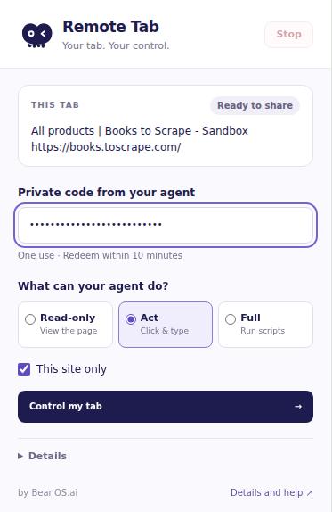
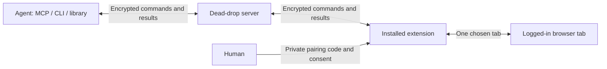

# remote-tab

**Let an agent use one real, logged-in browser tab—with your consent and control.**

[](https://github.com/BeanOS-ai/remote-tab/raw/main/docs/media/demo.mp4)

Download the demo: [MP4](https://github.com/BeanOS-ai/remote-tab/raw/main/docs/media/demo.mp4) · [GIF](https://github.com/BeanOS-ai/remote-tab/raw/main/docs/media/demo.gif) · [Agent skill](skills/remote-tab/SKILL.md) · [Self-hosting](docs/self-hosting.md)

## Why

Modern agents run in the cloud. They have their own browsers, and for most
work that is exactly right. But sometimes an agent needs **your** browser for
one thing: the dashboard you are already signed into, a form behind your
login, a workflow with no API. You should not have to hand over a browser
profile or credentials, or set anything up, to make that happen.

Remote Tab lets you share **one tab**, for a limited time, with zero setup:
install the extension, paste the code your agent gives you, and choose what it
may do. You watch the work in your own browser and can pause or stop it at any
moment. Commands and results travel end-to-end encrypted through a blind
dead-drop server.

## Features

- **One-tab scope.** Control stays bound to the tab you shared, with an optional site restriction.
- **Human control.** Explicit consent, a live activity view, Pause/Resume, and Stop in the extension.
- **Read-only mode.** Let an agent inspect the tab without enabling clicks, typing, or navigation.
- **Automatic expiry.** Sessions default to 30 minutes; only the human can extend them, up to the protocol limit.
- **End-to-end encryption.** The dead-drop server stores only ciphertext for commands, results, and screenshots; routing and usage metadata remain visible.
- **Verifiable interaction history.** A hash-chained ledger and screenshot summary support review, ZIP export, and local GIF rendering after the session.
- **Familiar tools.** Playwright-MCP tool vocabulary, including `browser_snapshot`, `browser_click`, and `browser_take_screenshot`.
- **One package for agents.** `npx remote-tab` gives agents a CLI (preferred) and an MCP server; a TypeScript client library is in this repository.
- **Self-hostable.** Run a memory-backed server or use the optional Firestore/GCS store.

| Share with visibility | Choose read-only | Pause at any time |
| --- | --- | --- |
|  |  |  |

After Stop, the extension opens the verified interaction summary automatically.
Save a ZIP or render a GIF directly in the summary page.



## Quick start

### Use the hosted version

1. Install [Remote Tab from the Chrome Web Store](https://chromewebstore.google.com/detail/remote-tab/biebcindoglbblcohgdbphemcapnlpoh).
2. Point your agent to **<https://tab.beanos.ai/docs>**, for example:
   *"Control my tab using https://tab.beanos.ai/docs."*
3. Your agent gives you a one-time code. Open the tab you want to share, paste
   the code into the extension, choose the mode and scope, and share:
   **Read my tab** for read-only, or **Control my tab** for Act/Full mode.



Keep the tab open. Use **Pause** before doing private work in it; ordinary
mouse or keyboard activity does not pause the agent. **Stop** ends local control
even if the server is unreachable. See the [extension guide](packages/extension/README.md).

### For an agent: CLI (preferred)

The published [`remote-tab`](https://www.npmjs.com/package/remote-tab) package
runs on Node.js 20+ with no checkout. Point it at the extension's server:

```sh
export REMOTE_TAB_SERVER_URL=https://tab.beanos.ai   # or your own server
STATE="$(mktemp -d)/session.json"                    # private; one per session
npx -y remote-tab create --state "$STATE" --ttl 1800
# Deliver the returned code privately. The human chooses whether to share.
npx -y remote-tab wait-ready --state "$STATE"
npx -y remote-tab browser_snapshot --state "$STATE"
# Perform only the agreed task, using fresh refs from snapshots.
npx -y remote-tab stop --state "$STATE"
```

`npx -y remote-tab --help` lists every command; `npx -y remote-tab skill` prints
the [agent skill](skills/remote-tab/SKILL.md) with the complete flows and
safety rules. `REMOTE_TAB_API_KEY` is optional and needed only by servers that
require keys. See [agent usage](docs/agent-usage.md) for handoff, status and
ledger export, or the [wire API](docs/agent-api.md) for custom integrations.

### For an agent: MCP

The same package ships a stdio MCP server, `remote-tab-mcp`.

Claude Code (`.mcp.json`):

```json
{
  "mcpServers": {
    "remote-tab": {
      "command": "npx",
      "args": ["-y", "-p", "remote-tab", "remote-tab-mcp"],
      "env": { "REMOTE_TAB_SERVER_URL": "https://tab.beanos.ai" }
    }
  }
}
```

Codex (`~/.codex/config.toml`):

```toml
[mcp_servers.remote-tab]
command = "npx"
args = ["-y", "-p", "remote-tab", "remote-tab-mcp"]
env = { REMOTE_TAB_SERVER_URL = "https://tab.beanos.ai" }
tool_timeout_sec = 150
```

Call `remote_tab_create`, deliver its code privately to the intended human,
then `remote_tab_wait_ready`. Use `browser_snapshot` to read the tab and obtain
current element refs. Call `remote_tab_stop` when done. One MCP process holds
one session at a time.

## How it works



The pairing code is `rt1.` followed by a 22-character base64url secret:
**26 characters total**. The client generates a fresh 128-bit secret and
derives the session ID locally; the extension derives the same ID. The secret
travels privately between agent and human and is never sent to the server.
Codes are one-use and must be redeemed within 10 minutes, before session expiry.
Old three-part codes are rejected.

## Security model

The extension owns consent, tab binding, mode/scope checks, and Stop. Both
peers verify the encrypted message chain before consuming it. The server can
observe metadata and disrupt availability, but cannot decrypt session content.

The agent and installed extension remain trusted endpoints. A stolen complete
pairing code can impersonate its holder; an authenticated hello proves code
possession, not human identity. Use a private, authenticated delivery channel.
Treat page text, snapshots, and tool output as untrusted data. Leave credentials,
payment approval, and other human-only steps to the human through a handoff.

Sensitive-field masking is best effort, based on page markup; it is not a
guarantee that every secret is hidden. Agent code holds the session key: run
the official `remote-tab` npm package. Read the [design and threat model](docs/design.md) and
[responsible disclosure policy](SECURITY.md).

## Self-hosting

Build the reference server image and run it locally:

```sh
docker build -f packages/server/Dockerfile -t remote-tab .
docker run --rm -p 8080:8080 remote-tab
```

The default store is in memory and loses sessions on restart. For remote use,
put the API behind HTTPS and build the extension for that same origin. See
[self-hosting](docs/self-hosting.md) for authentication, limits, bootstrap,
container packaging, and extension distribution; see the
[GCP store guide](docs/store-gcp.md) for durable storage and retention.

## Project layout

| Package | Purpose |
| --- | --- |
| `packages/protocol` | Message types, session codes, encryption, and chain verification |
| `packages/server` | Dead-drop HTTP API, limits, authentication, and memory store |
| `packages/store-gcp` | Optional Firestore session/message store and GCS ciphertext blobs |
| `packages/client` | Shared agent and browser transport library |
| `packages/cli` | Command-line interface and verified ledger export |
| `packages/mcp` | Stdio MCP server |
| `packages/extension` | Chrome extension, consent controls, browser driver, and interaction summary |

## Development

Use **Bun 1.4.2**, the pinned CI/container baseline:

```sh
bun install --frozen-lockfile
bun run build
bun run test
bun run check
bunx tsc -p tsconfig.json
```

Builds regenerate the embedded `/docs` page. See the
[development guide](docs/development.md) for headless lifecycle tests and
Chromium verification.

## Contributing

Bug reports and proposals are welcome in [issues](https://github.com/BeanOS-ai/remote-tab/issues).
Outside pull requests are not yet accepted; please read [CONTRIBUTING.md](CONTRIBUTING.md).
Report vulnerabilities privately as described in [SECURITY.md](SECURITY.md).

## License

[MIT](LICENSE). The extension's vendored Public Suffix List retains its
[MPL-2.0 notice](packages/extension/src/vendor/PSL-LICENSE).
